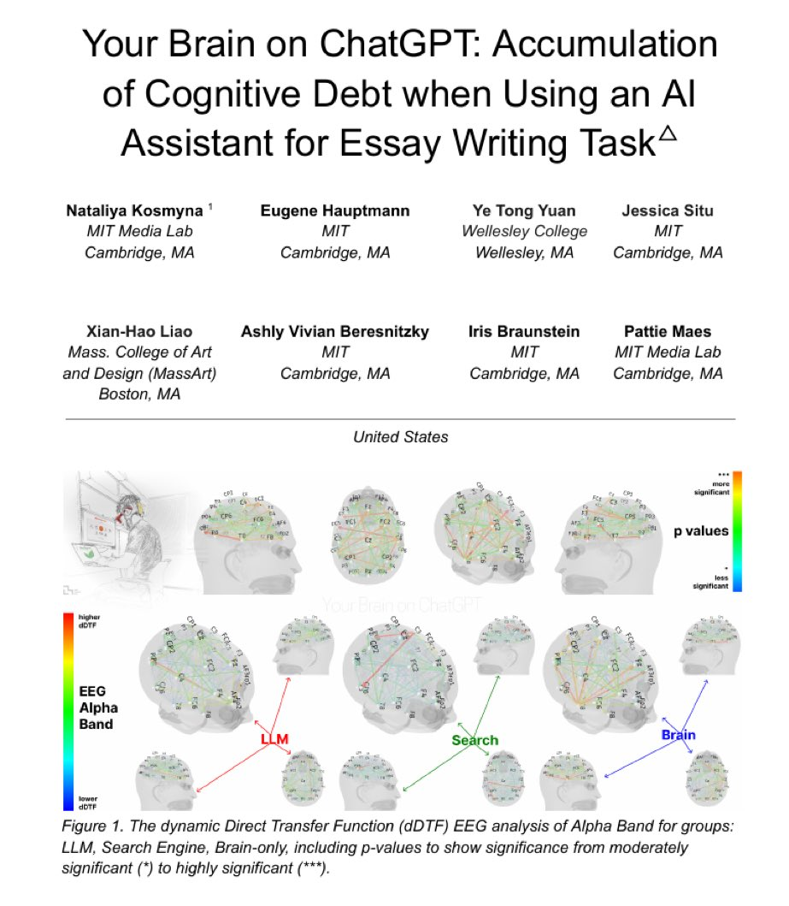

---

## "AI makes good coders better, and bad coders worse." 

*- Ivan Leo, 567-labs/Instructor maintainer*

---

This paper went viral recently on X:

{ width=50% align=center }

TLDR; Excessive early reliance on AI tools may hinder the formation of durable memory traces and critical thinking skills, a phenomenon termed "cognitive debt." The study suggests a hybrid approach—alternating between tool-free and AI-assisted phases—could balance efficiency with cognitive agency.

## What does this mean for AI-intensive work?

### Understanding codebases

Work that interact the most with AI as an assistant is coding. At least in my circles.

I realised this before the study was out, but the paper managed to formalize and put it into the exact words that I couldn't. Why am I writing a blog for this? I am writing to remind myself and formalize my own roadmap for using AI effectively. I think looking through the documentation and understanding how it was done before AI is really important.

For example, today I was figuring out how to write test cases, and I realised that understanding where to look and how to read a file is so important. Code is not meant to be read like natural language. You need to skip all the unecessary shit that will confuse you. If you were tackling testing with `unittest` and `pytest` for the first time, you would be stuck trying to read and understand `@pytest.fixture`.

As such, the very first thing that you should do when using AI to understand a codebase is to ask it to point you to the right place, make a plan to understand the codebase easily, at the repo level, and then at the individual file reading level. 

Another example is the verbosity of Springboot applications. You have to know where to read from above and read from below. Reading from above is useful when we're looking at user flow, but for code flow, reading from the core functions then reading the utility functions later is the better approach.

Using AI to understand dependency relations is one great use of it.

Large codebases can be overwhelming, so use AI to identify structure and dependencies, then dive into details manually.

### Understanding documentation

Use AI to map and explain the codebase, but actively verify and internalize the information yourself.

When you don't understand a particular function, SEARCH THE FUNCTION DOCUMENTATION UP. Read the documentation for that function, then ask AI about it, and treat it like an alternative voice, and see if you think it aligns well with your own understanding of the function from the documentation. **This is important.**

## Should you ask AI if you are right? 

Many people find that this can improve their understanding of something.

I'm not really a proponent of this. AI is not really good at being a judge. Ask it to judge you by referencing real life examples, then verify and cross-reference your code with examples yourself.

Theres an inherent feeling when you know you KNOW something while typing your explanation to the LLM, too.